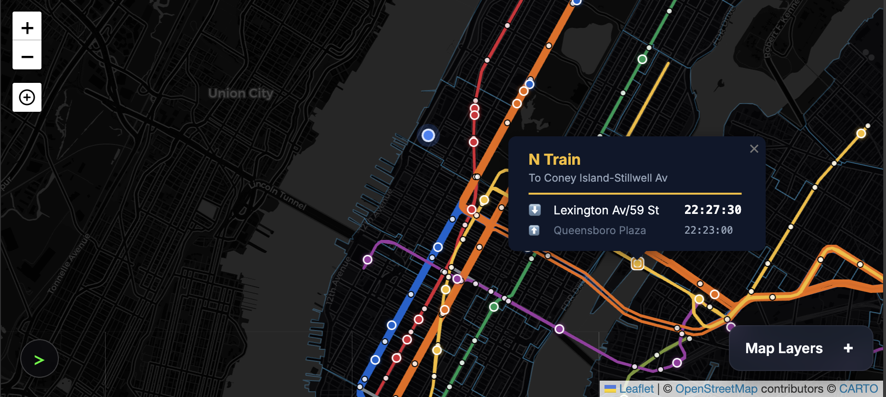

# NYC Real-Time Transit Map
A real-time visualization of the New York City transit system, combining MTA subway data with Citi Bike availability. The application renders train movements based on a hybrid system of static schedules and live GTFS-Realtime signal data.



## data-sources
The application aggregates data from the following public APIs:
- **MTA GTFS-Static**: Provides the base schedule, route geometries (shapes.txt), and station locations.
- **MTA GTFS-Realtime**: Provides live updates via Protocol Buffers (ProtoBuf). The backend server aggregates all available feeds:
    - **GTFS (1-7, S)**: Main IRT lines and 42nd St Shuttle.
    - **GTFS-ACE (A/C/E/H)**: 8th Ave lines and Rockaway Shuttle.
    - **GTFS-NQRW (N/Q/R/W)**: Broadway lines.
    - **GTFS-BDFM (B/D/F/M)**: 6th Ave lines.
    - **GTFS-L (L)**: Canarsie line.
    - **GTFS-G (G)**: Crosstown line.
    - **GTFS-JZ (J/Z)**: Nassau St lines.
    - **GTFS-7 (7)**: Flushing line.
    - **GTFS-SI (SIR)**: Staten Island Railway.
- **Citi Bike GBFS (General Bikeshare Feed Specification)**: Provides real-time station status (bikes available, e-bikes available, docks available).

## Architecture

The project employs a client-heavy architecture to minimize server load and latency.

### Backend (`server.py`)
- **Runtime**: Python 3.9+.
- **Framework**: Standard Library `http.server`.
- **Responsibilities**:
    - Serves static assets (HTML/JS/CSS).
    - Acts as an API proxy for MTA Realtime Feeds to handle CORS.
    - Parses GTFS Protobuf data using `google.transit.gtfs_realtime_pb2` and converts it to JSON for the client.
    - Serves static assets (HTML/JS/CSS).
    - Acts as an API proxy for MTA Realtime Feeds to handle CORS.
    - Parses GTFS Protobuf data using `google.transit.gtfs_realtime_pb2` and converts it to JSON for the client.
    - Implements in-memory caching for Realtime feeds (30s TTL) and Alerts (60s TTL), fetching from MTA only on-demand when client requests come in.

### Frontend
- **Framework**: Vanilla JavaScript (ES6 Modules).
- **Rendering Engine**: Leaflet.js.
- **Geospatial Processing**: Turf.js (used for line slicing, train positioning, and geometry snapping).
- **State Management**:
    - `animation.js`: Manages the requestAnimationFrame loop. It interpolates train positions along the SVG path based on the current time and live schedule deviations.
    - `realtime.js`: Polls the backend for trip updates and maintains a synchronization map (`tripId` -> `deviation`).
    - `alerts.js`: Polls for service alerts and updates the UI accordingly.

## Installation & Running Locally

### Prerequisites
- Python 3.9 or higher.
- `pip` (Python Package Manager).

### Setup
1.  **Clone the repository**.
2.  **Initialize the Environment**:
    The included script sets up a virtual environment and installs the required `requests` and `protobuf` libraries.
    ```bash
    ./run_dev.sh
    ```
3.  **Access the Application**:
    Navigate to `http://localhost:8001`.

### Data Updates
The static schedule data (`data/subway_schedule.json`) is generated from the raw MTA GTFS dump. To update the base topology or schedule:
1.  Download the latest NYC Subway GTFS.
2.  Run the ETL script:
    ```bash
    python3 scripts/update_data.py
    ```

## Development Reference

### Project Structure
```
.
├── server.py              # Main backend server (API & Static File serving)
├── index.html             # Application entry point
├── run_dev.sh             # Dev startup script
├── scripts/
│   ├── update_data.py     # ETL script to download/process GTFS data
│   ├── build_stops_json.py# Extract simple coordinate map (ID -> Lat/Lon) from stops.txt
│   └── optimize_geojson.py# Utility to minify shape data
├── src/                   # Frontend Source Code
│   ├── main.js            # App initialization & core logic
│   ├── map.js             # Leaflet map configuration & rendering
│   ├── animation.js       # Train animation loop & path interpolation
│   ├── realtime.js        # GTFS-Realtime processing
│   ├── stations.js        # Station rendering & schedule logic
│   ├── citibike.js        # Citi Bike data integration
│   ├── alerts.js          # Service alerts state
│   └── logger.js          # Remote logging utility
└── data/                  # Generated data artifacts (gitignored except examples)
```

### Debugging
- **Logs**: The frontend pipes `console.log` to the backend when `?debug=true` is in the URL. Check `frontend_debug.log`.
- **Backend**: `server.py` output is printed to stdout/stderr.
- **Visuals**: Use `isDebugSegment` in `animation.js` to inspect path finding logic for specific trains.

## Roadmap

101: ### Visuals & UX
102: - [ ] **Realistic Train Sizing**: Optionally show trains in a more realistic size (real length based on number of wagons, either real or estimated).
103: - [ ] **Citi Bike Timelapse**: Create a 24h/7d timelapse visualization of station availability.
104: - [ ] **Restyle Debug Menu**: Update the status panel (`SYSTEM_STATUS`) to match the glassmorphic aesthetics of the search bar and other UI elements.
105: 
106: ### Compliance & Architecture
107: - [ ] **Progressive Web App (PWA)**: Implement PWA features for offline availability of the app and subway schedule data.
108: - [ ] **Smart Filtering**: Cache Citi Bike data (~30s TTL) to avoid reloading on filter changes.
109: - [ ] **Data Optimization**: Evaluate migrating JSON schedule data to a binary format (e.g., FlatBuffers) for faster parsing.
110: - [ ] **Modularization**: Continue breaking down `stations.js` and `animation.js` into smaller, domain-specific modules.
111: 
112: ## Known Issues
113: - **Route 3 Live Data Missing**: The MTA's `nyct/gtfs` feed is currently not reporting any trips for Route 3 (Red line), causing it to fall back to the static schedule. This has been confirmed as an upstream data issue.
114: - **Ghost Trains**: Greatly reduced by strict aliasing and data ingestion improvements, but occasional mismatches may occur during rerouting events.
115: - **Realtime Reload Jitter**: Reloading realtime data affects interpolation smoothness.
116:

## Development Workflow
> [!IMPORTANT]
> **Verify before Commit**: Do not commit changes to the main branch before explicitly confirming with the user that the functionality works as expected.
> **DO NOT PUSH**: Do not push changes to the remote repository without explicit user permission.

## Deployment

### Railway Integration
The application is hosted on [Railway](https://railway.app/).
- **Live URL**: [https://nycmetro-production.up.railway.app/](https://nycmetro-production.up.railway.app/)
- **Auto-Deploys**: The `prod` branch is automatically deployed to Railway.

### Publishing Updates
To deploy the latest changes to production:

1.  **Ensure `main` is stable** and changes have been verified.
2.  **Push `main` to `prod`**:
    ```bash
    git push origin main:prod
    ```
    *(This commands pushes your local `main` branch to the remote `prod` branch, triggering a deployment.)*

## Agent Learnings
1. **Centralized Logic**: Moving shared logic (like `getMatchingTrip` in `realtime.js`) early prevents "Ghost Train" bugs where different parts of the app behave inconsistently.
2. **Robust UI Config**: When adding dynamic text (like "Approaching"), always check for text wrapping and adjust container widths/flex properties immediately.